<!-- markdownlint-disable MD007 -->
<!-- markdownlint-disable MD010 -->
<!-- markdownlint-disable MD024 -->
# Development Records of Style Align Stable Diffusion

- [Development Records of Style Align Stable Diffusion](#development-records-of-style-align-stable-diffusion)
	- [Testing Pre-trained SD2-1](#testing-pre-trained-sd2-1)
	- [SD Interpretation](#sd-interpretation)
		- [Model Architecture](#model-architecture)
		- [Method](#method)
		- [Training](#training)
		- [Usage](#usage)
	- [Style Align](#style-align)
		- [Style Align Demo Testing](#style-align-demo-testing)
		- [Style Align Demo in Jittor Version](#style-align-demo-in-jittor-version)
	- [StyleID](#styleid)
		- [Run StyleID](#run-styleid)
		- [Method](#method-1)
		- [StyleID on Jittor](#styleid-on-jittor)
	- [Reference](#reference)
		- [Websites](#websites)
		- [Paper](#paper)

## Testing Pre-trained SD2-1

```python
import jittor as jt
from JDiffusion import StableDiffusionPipeline
jt.flags.use_cuda = 1

# before testing, run `export HF_ENDPOINT="https://hf-mirror.com"`(bash)
pipeline = StableDiffusionPipeline.from_pretrained("stabilityai/stable-diffusion-2-1")
prompt = "xxxxxxxxxxxxxxxxxxxxxxxxxxxxxxxxxxxxxx"

images = pipeline(prompt, height=512, width=512).images[0]
images.save('./output/test_sd2-1.jpg')
```

## SD Interpretation

### Model Architecture

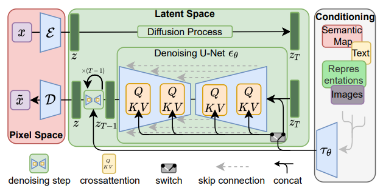
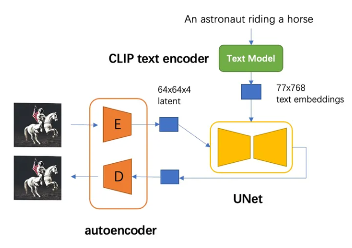

1. Part I: autoencoder
	- The encoder encoders image into a latent representation.
	- The decoder reconstructs the image from the latent.
2. Part II: CLIP text encoder
	- Used to extract text embeddings of input text, which is then passed to UNet as condition by cross attention.
3. Pert III: UNet
	- UNet is the backbone of the DM, which is used to generate the latent representation.

	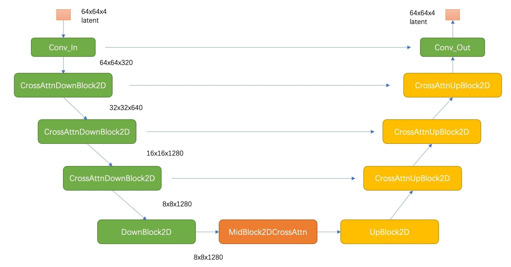

	in which:

	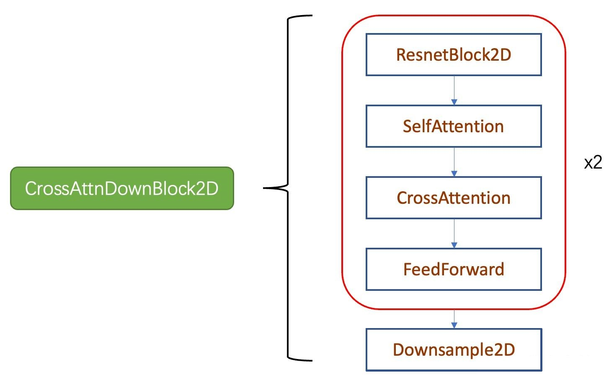

### Method

1. Perceptual Image Compression
    - Given an image x *H x W x 3* in RGB space, the encoder ε encodes x into a latent representation z = ε(x) in the shape of *h x w x c*.
    - Then the decoder D reconstructs the image from the latent.
2. Latent Diffusion Models
3. Conditioning Mechanisms
	- Turn DMs into more flexible conditional image generators by argumenting their underlying UNet backbone with the cross-attention mechanism.
	- To pre-process y from various modalities, intorduce a domain specific encoder that projects y to an intermediate representation, which is then mapped to the intermediate layers of the UNet via a cross-attention layer.

### Training

1. Code:

	```python
	"""---------------"""
	"""just an example"""
	"""---------------"""

	import torch
	from diffusers import AutoencoderKL, UNet2DConditionModel, DDPMScheduler
	from transformers import CLIPTextModel, CLIPTokenizer
	import torch.nn.functional as F

	# load autoencoder
	vae = AutoencoderKL.from_pretrained("runwayml/stable-diffusion-v1-5", subfolder="vae")
	# load text encoder
	text_encoder = CLIPTextModel.from_pretrained("runwayml/stable-diffusion-v1-5", subfolder="text_encoder")
	tokenizer = CLIPTokenizer.from_pretrained("runwayml/stable-diffusion-v1-5", subfolder="tokenizer")
	# initalize UNet
	unet = UNet2DConditionModel(**model_config)
	# 定义scheduler
	noise_scheduler = DDPMScheduler(
		beta_start=0.00085, beta_end=0.012, beta_schedule="scaled_linear", num_train_timesteps=1000
	)

	# freeze vae and text_encoder
	vae.requires_grad_(False)
	text_encoder.requires_grad_(False)

	opt = torch.optim.AdamW(unet.parameters(), lr=1e-4)

	# training step
	for setp, bath in enumerate(train_dataloader):
		with torch.no_grad():
			# image to latent
			latents = vae.encode(batch["image"]).latene_dist.sample()
			latents = latents * vae.config.scaling_factor
			# text embddings
			text_input_ids = text_tokenizer(
				batch["text"],
				padding="max_length",
				max_length=tokenizer.model_max_length,
				truncation=True,
				return_tensors="pt"
			).input_ids
			text_embeddings = text_encoder(text_input_ids)[0]

		# sample noise
		noise = torch.randn_like(latents)
		bsz = latents.shape[0]
		# sample timestep
		timesteps = torch.randint(0, noise_scheduler.num_train_timesteps, (bsz,), device=latents.device)
		timesteps = timesteps.long()
		# diffusion process
		noisy_latents = noise_scheduler.add_noise(latents, noise, timesteps)

		# predict noise and calculate loss
		model_pred = unet(noisy_latents, timesteps, encoder_hidden_states=text_embeddings).sample
		loss = F.mse_loss(model_pred.float(), noise.float(), reduction="mean")

		opt.step()
		opt.zero_grad()
	```

2. CFG (Calssifier-Free Guidance):
	- In this method, `pred_noise = w * cond_pred_npise + (1 - w) * uncond_pred_noise`.
	- Implementation: drop part of the text with a certain probability.

### Usage

1. Text to Image

    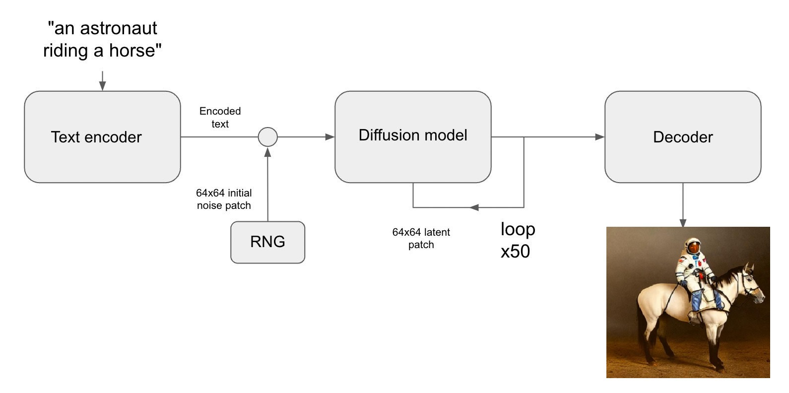

    - Code:

   	```python
   	import jittor as jt
   	from JDiffusion import StableDiffusionPipeline
   	jt.flags.use_cuda = 1

   	# before testing, run `export HF_ENDPOINT="https://hf-mirror.com"`(bash)
   	pipeline = StableDiffusionPipeline.from_pretrained("stabilityai/stable-diffusion-2-1")
   	prompt = "xxxxxxxxxxxxxxxxxxxxxxxxx"

   	images = pipeline(prompt, height=512, width=512).images[0]
   	images.save('./output/test_sd2-1.jpg')
   	```

    - Discussions on some parameters:
       - Image size: generates the best results at 512x512 size.
       - `num_inference_steps`
           - The larger the number of sampling steps, the better the quality of the generated image, but the corresponding inference time is also longer.
           - Too many steps is not necessary.
       - `guidance_scale`
           - The larger `guidance_scale`, the more consistent the resulting image should be with the input text.
           - However, too large `guidance_scale` causes images with oversaturated colors.
       - `negative_prompt`
           - `negative_prompt` is the text input to the unconditional diffusion model.
           - We can use negative_prompt which is not null to avoid that the image generated by the model contains something unwanted
2. Image to Image

    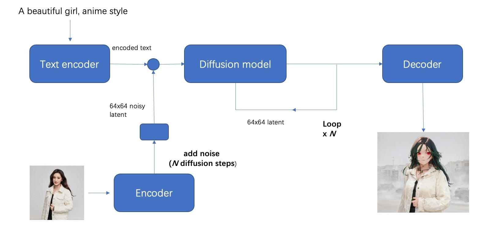

3. Inpainting

## Style Align

### Style Align Demo Testing

see [README.md](./style-Align-torchdemo/README.md)

1. Testing Style Align with SDXL text to image:

	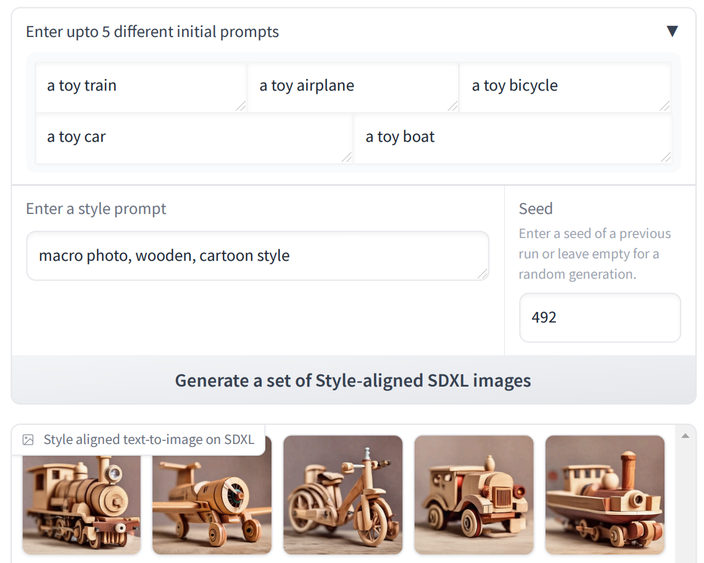

2. Testing Style Align + Multidiffusion with SDv2 image to image:

	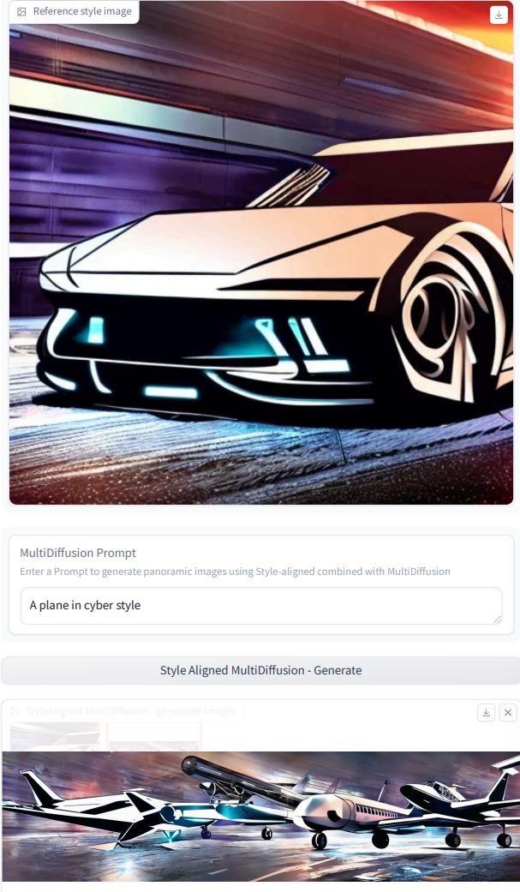

### Style Align Demo in Jittor Version

- *needs to be done* (templately abandoned)

## StyleID

### Run StyleID

1. Remember to add `src` to path.
2. Using `pip install taming-transformer` of `pip install clip` may help (or not);
3. Result:

	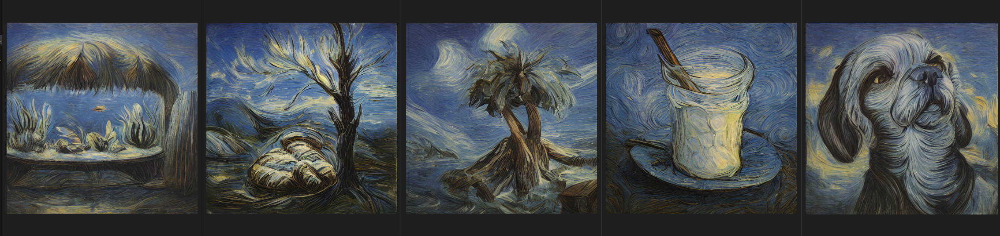

### Method

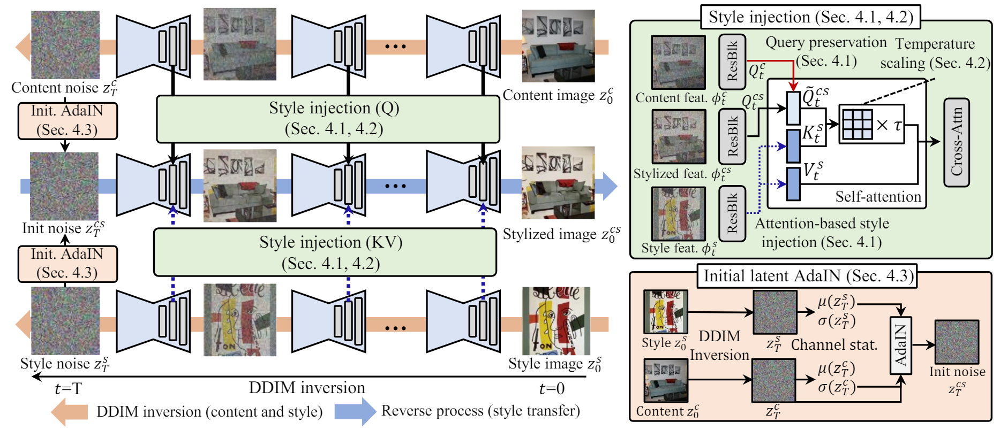

1. Attention-based Style Injection
	- Obatin the latent for the content and style images with DDIM inversion.
	- Collect the self-attention features of style iamge over the DDIM inversion.
	- Initialize stylized latent noise by copying content latent noise.
	- Transfer the target style to the stylized latent by injecting the key and value collected from the style into self-attention handler.
	- For pre-defined timesteps t={0,...,T}, style and content images are inverted from image(t = 0) to gaussian noise(t = T).
	- During DDIM inversion, query features of content and key values features of style are colleceted at every time step.
	- Style injection and query preservation precess at time step t:

		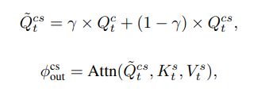

2. Attention Temperature Scaling
	- If we substitute the key features with those of style images instead of original images, the magnitude of similarity would be overall lowered as style and content are highly likely to be irrelevant.
	- Calculate the attention map before applying softmax.
	- To rectify the attention map sharper, we introduce an attention temperature scaling parameter.

		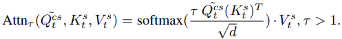

3. Initial Latent AdaIN
	- The style transfer only with attention-based style injection often fails in terms of capturing the color tone of the given style.
	- DM tends to generate images of median colors as the initial noise is sampled from zero mean and unit variance. Therefore, use the initial latent of style for th style transfer process.
	- However, simply starting to generate the image from style latent leads to the strctural information of synthesized results following the style image and losing the structire of the content.
	- Thus, employ AdaIN to modulate the initial latent for effective tone information transfer to make suer that the initial latent preserves content information from content image while aligning the channel-wise mean and standard deviation with style image.

		

### StyleID on Jittor

Origin version is built on [sd-v1-4](https://huggingface.co/CompVis/stable-diffusion-v-1-4-original) and PyTorch and without using `diffusers`.

1. DDIM inversion
	- DDIM inversion on sd14 or sd15
	- DDIM inversion on sd21
	- Saving features during inversion by class `AttnProcessor`
2. Initial noise gernerating (AdaIN)
3. Style injection during DDIM reversion

## Reference

### Websites

1. JDiffusion and Baseline [here](https://github.com/JittorRepos/JDiffusion)
2. Stable Diffusion 2-1 [here](https://huggingface.co/stabilityai/stable-diffusion-2-1)
3. An Interpretion to SD [here](https://zhuanlan.zhihu.com/p/617134893)
4. Style Align Project Page [here](https://style-Align-gen.github.io/)
5. StyleID github repository [here](https://github.com/jiwoogit/StyleID)
6. `DDIMScheduler` [here](https://hf-mirror.com/docs/diffusers/api/schedulers/ddim)

### Paper

1. [Denosing Diffusion Probabilistic Models](https://arxiv.org/pdf/2006.11239)
2. [Denoising Diffusion Implicit Models](https://arxiv.org/pdf/2010.02502)
3. [High-Resolution Image Synthesis with Latent Diffusion Models](https://arxiv.org/pdf/2112.10752)
4. [Style Align Image Generation via Shared Attention](https://arxiv.org/pdf/2312.02133)
5. [Style Injection in Diffusion: A Training-free Approach for Adapting Large-scale Diffusion Models for Style Transfer](https://arxiv.org/pdf/2312.09008)
6. [Imagen Video: High Definition Video Generation with Diffusion Models](https://imagen.research.google/video/paper.pdf)
